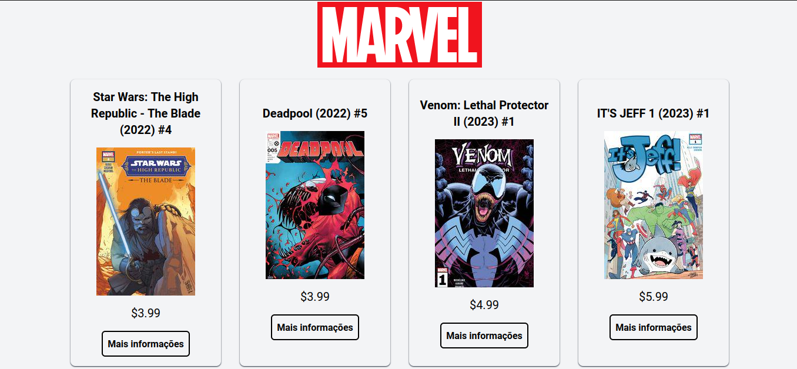

# Aplicativo Marvel

Este aplicativo foi desenvolvido através de desafio de um processo seletivo, a proposta foi criar uma tela para listar os quadrinhos da Marvel utilizando a API da Marvel, ao clicar em um card abrirá um modal com detalhes do quadrinho selecionado, no modal foi inserido um mapa utilizando o API do Google Maps, onde foi criado um campo para selecionar o endereço para onde o quadrinho deve ser enviado. Na requisição da API filtrei para buscar somente os quadrinhos lançados na última semana por questões de performance.

## Tecnologias utilizadas


Além das tecnologias mencionadas a aplicação utiliza o <a href="https://axios-http.com/" target="_blank">AXIOS</a> para requisições de dados da <a href="https://developer.marvel.com/" target="__blank">API da Marvel</a>, <a href="https://date-fns.org/" target="_blank">DATE-FNS</a> para a formatação das datas, da biblioteca de qualidade de código da Rocketseat, que por sinal é muito boa (<a href="https://github.com/rocketseat/eslint-config-rocketseat#readme" target="_blank">@rocketseat/eslint-config</a>), <a href="https://headlessui.com/" target="_blank">HeadlessUI</a> foi utilizado para o modal, sendo uma biblioteca desenvolvida pela equipe da TailwindCSS, sendo a <a href="https://github.com/ubilabs/google-maps-react-hooks" target="_blank">@ubilabs/google-maps-react-hooks</a> a biblioteca utilizada para a manipulação do Google Maps API (recomendo bastante, não é tão difícil utilizar) e não menos importante a estrutura da aplicação foi criada apartir do <a href="https://vitejs.dev/" target="_blank">Vite</a>, uma das ferramentas mais utilizadas atualmente para estrutura de projetos com ReactJS, sendo uma ótima opção ao create-app-react que foi descontinuado pela Meta.

<!-- ## Link da aplicação
[vercel]() -->

## Comando para instalar dependências e iniciar a aplicação

```javascript
npm i or npm intall
npm run dev

	or

yarn or yarn install
yarn dev
```

## O aplicativo está hospedado na Vercel
[https://app-marvel-comics.vercel.app/](https://app-marvel-comics.vercel.app/)
